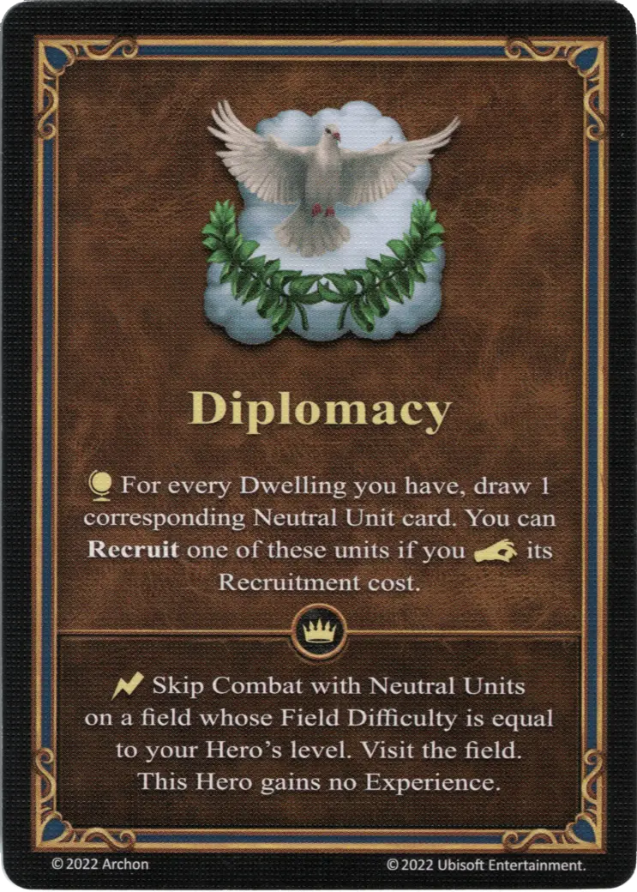

# Diplomacy

{ width="340" align=right }

___

[Ability](index.md)

___

:effect_map: For every Dwelling you have, draw 1 corresponding [Neutral Unit](../units/index.md) card. You can **Recruit** one of these [units](../units/index.md) if you :pay: its Recruitment cost.

___

 :expert: 

:instant: Skip Combat with [Neutral Units](../units/index.md) on a field whose Field Difficulty is equal to your Hero's level. Visit the field. This Hero gains no Experience.

___

## Heroes With Starting Ability

- [:magic: Cyra](../heroes/cyra.md)

## Notes

- If the player already has a :golden: dwelling, they draw cards from both, the :golden: and :azure: Neutral decks.
- The recruitment costs for neutral units can be found on the card of the respective unit.
- For recruitment that happens as a result of using this ability, the recruitment token shall not be flipped. This means this ability may be used even after the player has already recruited units during this round.
- [^1] When played with miniatures (e.g. such as when playing on the large battlefield), this ability cannot be used to recruit units from a faction controller by another player, nor to recruit neutral units that are already recruited by another player. Should a player draw such card, that may not be recruited, they shall draw a replacement card instead.

## Comes With

- [Core Game](../content/core_game.md)

## See Also

- [List of Abilities](index.md)

[^1]: Exceptions for specific game modes. This explanation is not valid for all game modes. The specific variant for the game mode is mentioned in the text.