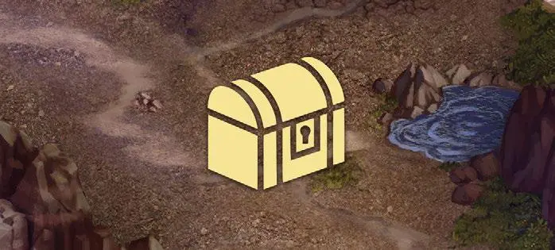

# Treasure

<figure markdown="span">

{ width="475" align=right }

</figure>

___

[Visitable Field](../keywords/visitable_field.md)

___

Roll a specified number of [Treasure Dice](../dice.md#treasure-die), then select one to resolve its effect.

___

## See Also

- [List of Fields](index.md)
- [List of Tiles](../tiles/index.md)
