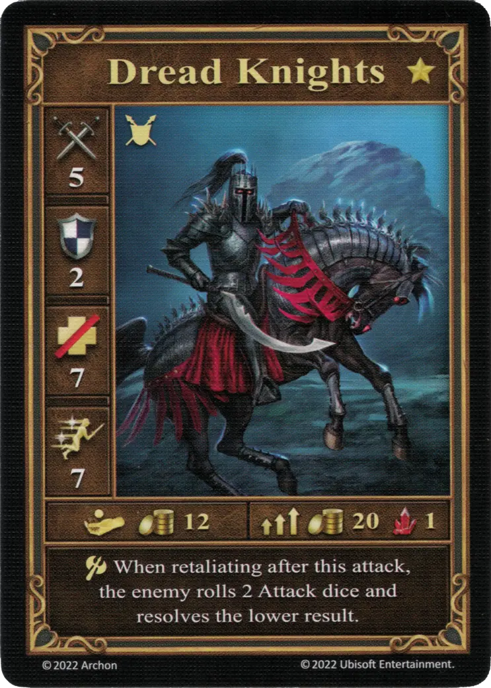
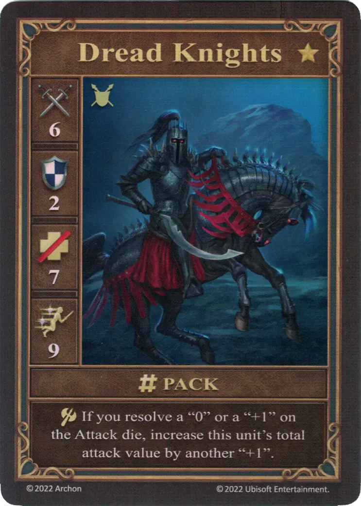
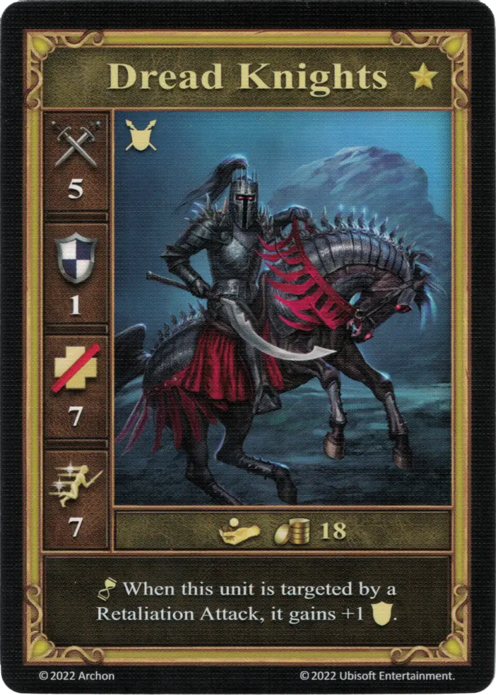

# Dread Knights

=== "Few"

    <figure markdown="span">
        { width="340" align=right }
    </figure>

=== "Pack"

    <figure markdown="span">
        { width="340" align=right }
    </figure>

=== "Neutral"

    <figure markdown="span">
        { width="340" align=right }
    </figure>

| Statistics | Few | Pack | Neutral |
| :--- | :---: | :---: | :---: |
| Town | [Necropolis](../towns/necropolis.md) | [Necropolis](../towns/necropolis.md) | [Neutral](../towns/neutral.md) |
| Tier | :golden: | :golden: | :golden: |
| Type | :unit_ground: | :unit_ground: | :unit_ground: |
| :attack: | 5 | **6** | 5 |
| :defense: | 2 | 2 | 1 |
| :health_points: | 7 | 7 | 7 |
| :initiative: | 7 | **9** | 7 |
| Cost | 12 :gold: | 20 :gold: 1 :valuables: | 18 :gold: |
| Abilities | :unit_attack: When retaliating after this attack, the enemy rolls 2 [Attack dice](../dice.md#attack-die) and resolves the lower result. | :unit_attack: If you resolve a "0" or a "+1" on the [Attack die](../dice.md#attack-die), increase this unit's total attack value by another "+1". | :unit_passive: When this unit is targeted by a Retaliation Attack, it gains +1 :defense:. |

## Heroes With A Specialty

- [:might: Lord Haart (Necropolis)](../heroes/lord_haart_necropolis.md#specialty)
- [:might: Tamika](../heroes/tamika.md#specialty)

## Notes

- [^1] Should the Dread Knights attack neutral [Crusaders](../units/crusaders.md), when the [Crusaders](../units/crusaders.md) retaliate against a few Dread Knights, they're abilities cancel out and a single [Attack die](../dice.md#attack-die) is rolled as if it was a regular attack.

## Comes With

- [Core Game](../content.md)

## See Also

- [List of Units](index.md)
- [List of Towns](../towns/index.md)

[^1]: Not officially confirmed by game designers, and is therefore considered a Community rule.